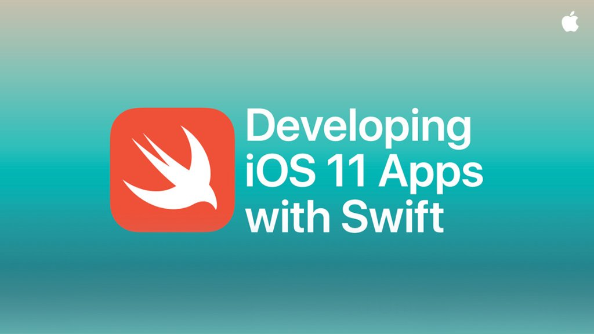

# Developing iOS 11 Apps with Swift

视频可以在iTunes U中观看。

## Lectures

Slides | Demo Code
------------- | -------------
[Lecture 1: Introduction to iOS 11, Xcode 9 and Swift 4](slides/Lecture_1_Slides.pdf)  | [Concentration_l1](code_demo/Concentration_l1)  
[Lecture 2: MVC's](slides/Lecture_2_Slides.pdf)  | [Concentration_l2](code_demo/Concentration_l2) 
Friday Session 1: Debugging and Xcode Tips and Tricks | breakpoint & shortcuts | 
[Lecture 3: Swift Programming Language](slides/Lecture_3_Slides.pdf)  | [Concentration_l3](code_demo/Concentration_l3)  
[Lecture 4: More Swift](slides/Lecture_4_Slides.pdf)  | [Concentration_l4](code_demo/Concentration_l4)
[Lecture 5: Drawing](slides/Lecture_5_Slides.pdf)  | [PlayingCard_l5](code_demo/PlayingCard_l5)  
[Lecture 6: Multitouch](slides/Lecture_6_Slides.pdf)  | [PlayingCard_l6](code_demo/PlayingCard_l6) 
[Lecture 7: Multiple MVCs, Timer and Animation](slides/Lecture_7_Slides.pdf)  | [Concentration_l7](code_demo/Concentration_l7) 
[Lecture 8: Animation](slides/Lecture_8_Slides.pdf)  | [PlayingCard_l8](code_demo/PlayingCard_l8)  
Friday Session 2: Github and Source Control Workflow | Xcode built in git 
[Lecture 9: View Controller Lifecycle and Scroll View](slides/Lecture_9_Slides.pdf) | [Concentration_l9](code_demo/Concentration_l9) [Cassini_l9](code_demo/Cassini_l9) 
[Lecture 10: Multithreading and Autolayout](slides/Lecture_10_Slides.pdf) | [Concentration_l10](code_demo/Concentration_l10) [Cassini_l10](code_demo/Cassini_l10)  
Friday Session 3: Instruments | Profile with Instruments
[Lecture 11: Drag and Drop, Table View and Collection View](slides/Lecture_11_Slides.pdf) | [EmojiArt_l11](code_demo/EmojiArt_l11) 
[Lecture 12: Drag and Drop, Table View, Collection View, and Text Field](slides/Lecture_12_Slides.pdf) | [EmojiArt_l12](code_demo/EmojiArt_l12) 
[Lecture 13: Persistence and Documents](slides/Lecture_13_Slides.pdf) | [EmojiArt_l13](code_demo/EmojiArt_l13) 
[Lecture 14: Persistence and Documents Demo](slides/Lecture_14_Slides.pdf) | [EmojiArt_l14_old](code_demo/EmojiArt_l14_old)  [EmojiArt_l14](code_demo/EmojiArt_l14) 
[Lecture 15: Alerts, Notifications, Application Lifecycle](slides/Lecture_15_Slides.pdf) | [EmojiArt_l15](code_demo/EmojiArt_l15)  [EmojiArt_l15_notification](code_demo/EmojiArt_l15_notification) 
[Lecture 16: More Segues](slides/Lecture_16_Slides.pdf) | 
[Lecture 17: Core Motion and Camera](slides/Lecture_17_Slides.pdf) | 

## Reading Assignments

Reading  | Name
| ------------- | -------------
| 1. | [Reading 1: Intro to Swift](reading/Reading_1_Intro_to_Swift.pdf)
| 2. | [Reading 2: More Swift](reading/Reading_2_Intro_to_Swift.pdf)
| 3. | [Reading 3: The Rest of Swift](reading/Reading_3_Finishing_Off_Swift.pdf)

## Problem Sets

PS  | Name
| ------------- | -------------
| 1. | [Assignment 1: Concentration](problem_sets/Programming_Project_1_Concentration.pdf)
| 2. | [Assignment 2: Set](problem_sets/Programming_Project_2_Set.pdf)
| 3. | [Assignment 3: Graphical Set](problem_sets/Programming_Project_3_Graphical_Set.pdf)
| 4. | [Assignment 4: Animated Set](problem_sets/Programming_Project_4_Animated_Set.pdf)
| 5. | [Assignment 5: Image Gallery](problem_sets/Programming_Project_5_Image_Gallery.pdf)
| 6. | [Assignment 6: Persistent Image Gallery](problem_sets/Programming_Project_6_Persistent_Image_Gallery.pdf)

